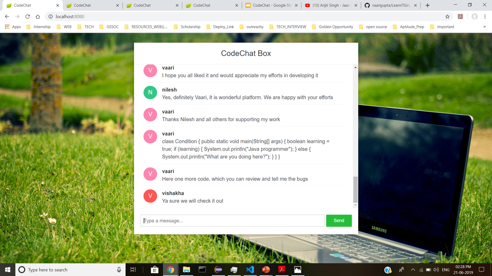

# LearnITGirl

The concerned project is being developed under the program **Learn IT, Girl !** . My project name is **CodeChat** which is being developed under the eye of my mentor [@vishaka](https://github.com/vishakha-lall)

## What is CodeChat all about?

 - CodeChat is used for sending codes like a chat message and makes your code easily shareable to others who have joined the session.  
 - If one user sends the code then, it is available to all other users who are currently active on that particular session.
 - If a new user joins a chat then, all the current members get a flash message of his / her joining the chat.

## Advantages of CodeChat

   It will play an effective role to assist programmers who are remotely located and need to share their code in collaboration
    
-   There is a availability of CHATBOX through which programmers can convey message to other programmers by sending message .
    
-   By providing a feature of sending message to all at once, ,the workload becomes less of the project manager

# Technology Used

 - Spring boot 
 - Web Socket 
 - HTML 
 - CSS 
 - Javascript

# Tools Used

 - Eclipse Oxygen 
 - Visual Studio Code
 -  Command line prompt 
 - Spring boot Suite

## Set up Environment

  

Before you begin , just make sure that your development environment includes `Node.js®` and an `npm package manager.`

  

### Node.js

  

Angular requires `Node.js` version 8.x or 10.x.

  

- To check your version, run `node -v` in a terminal/console window.

- To get `Node.js`, go to [nodejs.org](https://nodejs.org/  "Nodejs.org").

  

### npm package manager

  

Angular, the Angular CLI, and Angular apps depend on features and functionality provided by libraries that are available as [npm packages](https://docs.npmjs.com/getting-started/what-is-npm). To download and install npm packages, you must have an npm package manager.

  

This Quick Start uses the [npm client](https://docs.npmjs.com/cli/install) command line interface, which is installed with `Node.js` by default.

  

To check that you have the npm client installed, run `npm -v` in a terminal/console window.

  

### Install Angular CLI

  

To install the Angular CLI globally using `npm`, open a terminal/console window and enter the following command:

  

`npm install -g @angular/cli`

  

### Run Codechat

  

Run the following command :

  

https://github.com/vaarigupta/LearnITGirl_CodeChat.git

  

then next step is to, run the following command in the project folder ( cloned repo ) :

  

cd codechat

  

now install all dependencies with the command :

  

npm install

  

and here is the last step to finally see the CodeChat in your browser ( Make sure that you are inside the codechat folder )

  

ng serve

  
  

## ROADMAP

  

**week 1**

- Discuss flow of project

- Prepare temporary Layout of the User Interface

- Discuss about technology Stack used for the entire Project

  

**week 2**

- Learn Angular6

- Start Developing UI

  

**week 3**

- Learn some more concepts in Angular6

- Build Home Page

- Make User Profile

  

**week 4**

  

- Work on UI

- Create Page to generate a Session

- Page to Join a Session'

- Joined Session Pages

- Chat Page

- Code Page

- Start learning Spring Boot

  

**week 5**

- Key points to focus while learning spring boot :-

-  Learn how to implement authentication

-  How to integrate Angular6 with Spring boot

- Start Making and setting up authentication page

- Save user details in the database

  

**week 6**

- Complete Authentication

- Work on User Profile -

- Implement Create and Join a session functionality

  

**week 7**

In a joined Session ,

- Implement Chatting Part -

- develop chat functionalities

**week 8**

In a joined Session ,

- Complete Chat functionalities

start Implementing Code Part -

- Implement Syntax Highlighting as per the programming languages

- Implement some popular themes in Code Editor

  

**week 9**

- Work more on Code part

- Implement Compiler in the code

  

**week 10**

- Allow code written in text editor to be sent

- Show sent code to be displayed in the Code-chat Section

  

**week 11**

- Work more on CodeChat section

- Work on testing of code

- Fix all the bugs

- Implement Test Cases

  

**week 12**

- Fix more bugs

- Write test Cases

- Deploy the WebApp
